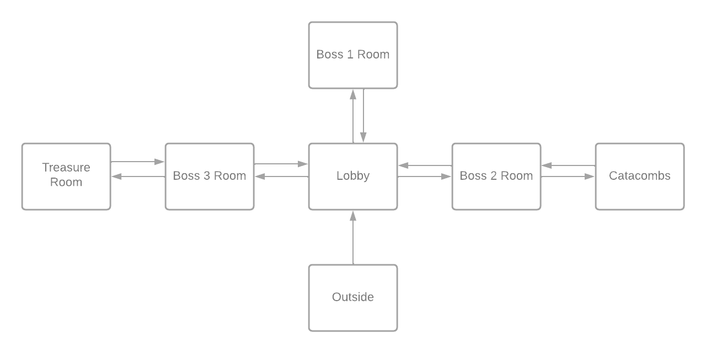
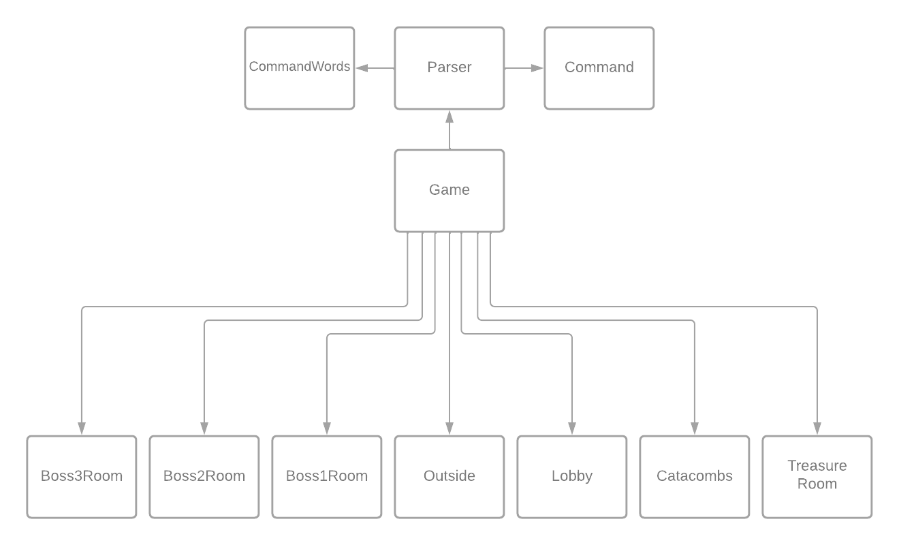

<h1 align="center">RAPPORT IPO</h1>

<p align="center">
  
</p>

<h1 align="center">2022</h1>
<br>
<h1 align="center"><a href="https://perso.esiee.fr/~diouyc/ZuulGOTYEdition"> Zuul GOTY Edition</a></h1>

<div style="page-break-after: always;"></div>

## Sommaire

- [Information générales](#information-générales)
  - [Auteur](#auteur)
  - [Thème](#thème)
  - [Scénario](#scénario)
  - [Plan](#plan)
  - [Scénario détaillé](#scénario-détaillé)
  - [Détail des lieux, items, personnages](#details-des-lieux)
  - [Situations gagnantes et perdantes](#situations-gagnantes-et-perdantes)
  - [Énigmes, mini-jeux, combats](#énigmes,-mini-jeux,-combats)
  - [Commentaires](#commentaires)
- [Réponses aux exercices](#réponses-aux-exercices)
- [Mode d'emploi](#)
- [Déclaration anti-plagiat](#)

<div style="page-break-after: always;"></div>

## Information générales

### Auteur

Charly **DIOUY**
E1 ESIEE PARIS
Groupe 1

### Thème

Un chevalier se retrouve coincé dans un donjon, il doit vaincre tout les boss pour s'échapper

### Scénario

Edward se retrouve bloqué dans un dongeon après s'être caché pendant une bataille, si il veut sortir il va devoir resoudre les énigmes de ce mysterieux dongeon.

### Plan

<p align="center">
  
</p>

### Scénario détaillé

Edward est un chevalier, durant une bataille il decide de s'aventurer dans les Terres Hostilles, un lieu que tous savaient dangereux. Vous incarnerez Edward et vous vivrez l'aventure avec lui. Il se retrouve fasse a une porte par terre, elle semble rouillée et ne pas avoir servi depuis plusieurs années. Une épaisse brume émane de cette porte. Edward décide de rentrer. Il arrive dans un dongeon et la porte disparait derrière lui. Il rencontre Garret, un marchant qui est resté enfermé ici et qui a perdu sa compagne dans ce dongeon. Il vous explique que le dongeon est ensorcelé par Hazelgash, un mage très puissant. Il vous informe aussi qu'avant de pouvoir accéder a la salle du mage il faudra vaincre ses deux serviteurs, un géant et un roi déchu, Warmog et Viego. Ils sont moins puissant que Hazelgash mais ils ont chacuns leurs points forts et leurs points faibles. Ça sera à vous de les trouver pour obtenir les artefacts qui seront utiles pour sortir de ce dongeon.

### Détail des lieux, items, personnages

- #### Lieux

  - Lobby
  - Salle du boss 1
  - Salle du boss 2
  - Salle du boss 3
  - Catacombes
  - Salle du trésor
  - Exterieur (debut du jeu, cinematique ???)

- #### Items

  - Armure de Warmog
  - Lame du Roi Déchu
  - Gantelet cryopyrique
  - Alliance de la défunte

- #### Personnages
  - Edward
  - Warmog le Geant
  - Viego le Roi Déchu
  - Hazelgash le mage Cryopyrique
  - Garret le marchant
  - Loryna la défunte
  - Wyatt le narrateur

### Situations gagnantes et perdantes

- #### Situations gagnantes

  - Rassembler les 3 artefacts
  - Rendre le marchant heureux

- #### Situations perdantes
  - Mourir contre un boss
  - Faire quelque chose d'immoral

### Énigmes, mini-jeux, combats

- #### Enigmes

  - Pourquoi le marchant est méchant au debut
  -

- #### Mini-jeux

  - pas encore d'idée
  -

- #### Combats
  - Combat contre les boss
  - Combat contre le marchant ?? (pas sur)

### Commentaires

Il y a encore beaucoup de travail pour tout finaliser

<div style="page-break-after: always;"></div>

## Réponses aux exercices

#### Exercice 7.0

Réalisation du site internet pour Zuul a l'adresse suivante : [Zuul GOTY Edition](https://perso.esiee.fr/~diouyc/ZuulGOTYEdition)

#### Exercice 7.5

La création de la méthode `printLocationInfo()` dans la classe `Game` permet d'éviter la duplication de code. En effet, il y a, à 2 reprises, le même segment de code (`goRoom()` et `printWelcome()`) pour informer le joueur de sa postion et les sorties disponibles. La création de `printLocationInfo()` permet de remplacer chaque occurence par un appel à la procedure, cela facilite aussi grandement les modifications futures car il y aura juste ce passage de code a modifier si on veut changer le texte pour les informations des salles.

```java
private void printLocationInfo()
{
    System.out.println("You are "+aCurrentRoom.getDescription());
        System.out.print("Exits : ");
        if(aCurrentRoom.aNorthExit != null){
            System.out.print("north");
        }
        if(aCurrentRoom.aEastExit != null){
            System.out.print("east");
        }
        if(aCurrentRoom.aSouthExit != null){
            System.out.print("south");
        }
        if(aCurrentRoom.aWestExit != null){
            System.out.print("west");
        }
        System.out.println();
}
```

Les modifications suivantes ont donc été effectuées dans `goRoom()` et dans `printWelcome()`

```java
public class Game
{
    [...]

    private void goRoom(final Command pDirection)
    {

        [...]

        else
        {
            this.aCurrentRoom=vNextRoom;
            printLocationInfo();
        }
    }

    private void printWelcome()
    {
        System.out.println("Welcome to the World of Zuul !");
        System.out.println("World of Zuul is a new, incredibly boring adventure game.");
        System.out.println("Type 'help' if you need help.");
        printLocationInfo();
    }

}
```

#### Exercice 7.6

La création de l'accesseur `getExit()` dans la classe `Room` permet de reduire le couplage, et de respecter un principe fondamental d'une bonne conception de classe qui est _l'encapsulation_. Cela nous permet de passer les attributs de la classe en privé. Le code passe de

```java
public class Room
{
    public String   aDescription;
    public Room     aNorthExit;
    public Room     aEastExit;
    public Room     aSouthExit;
    public Room     aWestExit;

    [...]
}
```

à

```java
public class Room
{
    private String   aDescription;
    private Room     aNorthExit;
    private Room     aEastExit;
    private Room     aSouthExit;
    private Room     aWestExit;

    [...]

    public Room getExit(String pDirection){
        if(pDirection.equals("north")){
            return aNorthExit;
        }
        if(pDirection.equals("east")){
            return aEastExit;
        }
        if(pDirection.equals("south")){
            return aSouthExit;
        }
        if(pDirection.equals("west")){
            return aWestExit;
        }
        return null;
    }
}
```

Il y a aussi des modifications à faire dans la classe `Game` qui sont

```java
public class Game
{

    [...]

    private void goRoom(final Command pDirection){

        [...]

        Room vNextRoom = aCurrentRoom.getExit(vDirection);

        [...]
    }

    [...]

    private void printLocationInfo()
    {
        System.out.println("You are "+aCurrentRoom.getDescription());
        System.out.print("Exits : ");
        if(aCurrentRoom.getExit("north") != null){  // précédemment if(aCurrentRoom.aNorthExit != null){
            System.out.print("north ");
        }
        if(aCurrentRoom.getExit("east") != null){   // précédemment if(aCurrentRoom.aEastExit != null){
            System.out.print("east ");
        }
        if(aCurrentRoom.getExit("south") != null){  // précédemment if(aCurrentRoom.aSouthExit != null){
            System.out.print("south ");
        }
        if(aCurrentRoom.getExit("west") != null){   // précédement if(aCurrentRoom.aWestExit != null){
            System.out.print("west ");
        }
        System.out.println();
    }
}
```

#### Exercice 7.7

La création de la méthode `getExitString()` doit être crée dans la classe `Room` car celle-ci gère tout ce qui réfère aux salles.

```java
public String getExitString()
    {
        String vExit = "Exits : ";

        if (this.aNorthExit!=null)
        {
            vExit += "north ";
        }

        if (this.aSouthExit!=null)
        {
            vExit += "south ";
        }

        if (this.aEastExit!=null)
        {
            vExit += "east ";
        }

        if (this.aWestExit!=null)
        {
            vExit += "west ";
        }
        return vExit;
    }
```

L'affichage se passe dans la classe `Game` avec la methode `printLocationInfo()` précédemment crée.

```java
private void printLocationInfo()
{
    System.out.println("You are "+currentRoom.getDescription());
    System.out.println(aCurrentRoom.getExitString());
}
```

#### Exercice 7.8

Modification des attributs de la classe `Room` pour les mettre dans une `HashMap`, pour ce faire il faut écrire en haut de la classe `import java.util.HashMap;`et pour la créer `private HashMap<String, Room> aExits;`. Le code de la classe `Room` est donc comme suit

```java
import java.util.HashMap;

public class Room
{
    private HashMap<String, Room> aExits;

    public Room(final String pDescription) {
        this.aDescription = pDescription;
        this.aExits = new HashMap<String,Room>();
    }

    public void setExit(final String pDirec, Room pNeighbor){
        aExits.put(pDirec, pNeighbor);
    }

    public Room getExit(String pDirection){
        return aExits.get(pDirection);
    }

    public String getExitString()
    {
        String vExit = "Exits : "+this.aExits;
        return vExit;
    }
}
```

et des changements dans `Game`

```java
public class Game
{

    [...]

    private void createRooms(){

        [...]

        vOutside.setExit("north", vLobby);

        vCatacombs.setExit("west", vBoss2Room);

        vLobby.setExit("north", vBoss1Room);
        vLobby.setExit("east", vBoss2Room);
        vLobby.setExit("west", vBoss3Room);

        vTreasure.setExit("east", vBoss3Room);

        vBoss1Room.setExit("south", vLobby);

        vBoss2Room.setExit("east", vCatacombs);
        vBoss2Room.setExit("west", vLobby);

        vBoss3Room.setExit("west", vTreasure);
        vBoss3Room.setExit("east", vLobby);

        [...]
    }

    [...]

}
```

#### Exercice 7.8.1

L'ajout d'un déplacement vertical entre l'extérieur et le dongeon est réalisé. Les directions sont donc maintenant : `north`, `east`, `south`, `west` et `down`

```java
vOutside.setExits("down", vLobby);
```

#### Exercice 7.9

La méthode `keySet()` permet d'associer des valeurs arbitraires à des clés.

```java
import java.util.Set;
```

Ainsi, il peut associer le mot de commande à la clé qui ouvrira l'accès à la `HashMap` contenant toutes les pièces. **Exemple :** pour le lobby, les sorties sont `north`, `east` et `west`. La clé nord sur la commande `go north` permettra d'accéder à la salle au nord du lobby.

#### Exercice 7.10

La methode `getExitString()` permet de récupérer toutes les sorties d'une pièce sous forme d'une `String`

```java
String vReturnString = "Exits : ";
```

Cette ligne crée une variable `vReturnString` de type `String` qui contient la chaine de caractères `"Exits : "`

```java
Set<String> vKeys = aExits.keySet();
```

Celle-ci crée une variable `vKeys` de type `Set<String>`. Les éléments contenus sont les clés de la `HashMap aExits` sous forme d'une liste de `String` qui ne peut pas comporter 2 fois le même élément.

```java
for(String vExit : vKeys){
    vReturnString += " " + vExit;
}
```

Ce bout de code est une boucle `for each` qui parcours la liste des clés stockées. `vExit` est une variable qui prend la valeur de la prochaine clé de la `HashMap`à chaque fois que la bocule se répète, ce qui fait que `vReturnString` obtient toutes les sorties disponibles dans la `String`.

```java
return vReturnString;
```

La derniere partie du code retourne la chaine de caractères possédant toutes les sorties de la salle.

#### Exercice 7.11

La fonction `getLongDescription()` retourne une chaine de caractères informant le joueur de sa position actuelle et des sorties de la salle

```java
public String getLongDescription(){
    return "You are " + aDescription + ".\n" + getExitString();
}
```

Dans la classe `Game` on effectue donc des modifications

```java
private void printLocationInfo() {
    System.out.println(aCurrentRoom.getLongDescription());
}
```

#### Exercice 7.12

Les objets crées au lancement du programme sont imagés dans ce diagramme

<p align="center">
  
</p>

#### Exercice 7.13

Lorsque la commande `go` est exécuté, l'objet courrant change, c'est a dire, passer d'une salle à l'autre

#### Exercice 7.14

On ajoute la commande `look` dans la classe `CommandWords` avec cette ligne

```java
this.aValidCommands[3] = "look";
```

Une fois fait, il faut créer une methode pour la commande `look` qui nous permettra d'avoir les informations sur la salle et ses sorties autant de fois que nous le souhaitons

```java
private void look(){
    printLocationInfo();
}
```

Nous devons ajouter les lignes de code ci-dessous dans la fonction `processCommand()` de la classe `Game` pour que la méthode fonctionne lorsqu'elle est saisie au clavier

```java
else if(pCommand.getCommandWord().equals("look")){
    this.look();
}
```

#### Exercice 7.15

On refait la même chose pour la commande `eat`. C'est à dire ajout de la commande `eat` dans la classe `CommandWords`

```java
this.aValidCommands[4] = "eat";
```

Création d'une méthode pour la commande `eat`

```java
private void eat(){
    System.out.println("You have eaten now and you are not hungry any more.");
}
```

Ajout des lignes de code ci-dessous dans la fonction `processCommand()` de la classe `Game` pour que la méthode fonctionne lorsqu'elle est saisie au clavier

```java
else if(pCommand.getCommandWord().equals("eat")){
    this.eat();
}
```

#### Exercice 7.16

On crée une méthode `showAll()` dans la classe `CommandWords` pour regrouper toutes les commandes dans une `String`

```java
public void showAll(){
    for(String vCommand : aValidCommands){
        System.out.print(vCommand + " ");
    }
    System.out.println();
}
```

Ensuite, dans la classe `Parser`, on crée une méthode `showCommands()` pour afficher toutes les commandes

```java
public void showCommands(){
    aValidCommands.showAll();
}
```

Puis on remplace le texte écrit "en dur" par la methode `showCommands()` afin de le rendre dynamique. Lorsque nous voudrons ajouter d'autres commandes, il s'adaptera automatiquement

```java
private void printHelp() {

    [...]

    System.out.println("Your command words are:");
    aParser.showCommands();
}
```

#### Exercice 7.17

Si nous voulons ajouter une autre commande il faudra modifier la classe `Game` en ajoutant la methode de la commande et ajouter la ligne permantant l'exécution dans `processCommand()`

```java
else if(pCommand.getCommandWord().equals("command")){
    this.command(); // command signifie une commande générale pouvant être intégrée au jeu
}
```

#### Exercice 7.18

Dans la classe `CommandWords` la méthode `showAll()` devient la fonction `getCommandList()` et subit les modifications ci-dessous

```java
public String getCommandList()
{
    StringBuilder sCommands = new StringBuilder();
    for(int i = 0; i < aValidCommands.length; i++) {
        sCommands.append( aValidCommands[i] + "  " );
    }
    return sCommands.toString();
}
```

La méthode `showCommands()` est aussi modifiée par une fonction `getCommandString()`

```java
public String getCommandString()
{
    return this.aValidCommands.getCommandList();
}
```

Les modifications sont légères dans `printHelp()` il y a juste à remplacer `aParser.showCommands()` par `aParser.getCommandString()`

```java
private void printHelp() {

    [...]

    aParser.getCommandString();
}
```

#### Exercice 7.18.1

Les deux projets sont vraiment similaires ce qui est logique car j'ai suivi les exercices demandés. Néanmoins il faut noter deux differences notables qui sont l'ajout des commandes : `look` et `eat`

#### Exercice 7.18.2

Objet mutable qui peut donc changer au cours du temps. On peut construire petit à petit une chaîne de caractère, avec la méthode `append()` qui ajoute des caractères à la suite des autres, et toString qui retourne la chaîne.
[source](https://docs.oracle.com/javase/7/docs/api/java/lang/StringBuilder.html)

#### Exercice 7.18.3

La recherche d'images est plutôt compliquée pour trouver ce qui me plait. Je vais m'orienter vers la création des decors pour le jeu.

#### Exercice 7.18.4

Le titre du jeu est : Zuul GOTY Edition

#### Exercice 7.18.5

Nous devons créer une `HashMap<>()` qui contiendra toutes les pieces

```java
private HashMap<String, Room> aRooms;
```

Nous l'initialisons ensuite dans `createRooms()`

```java
this.aRooms = new HashMap<String, Room>();
```

Puis nous devons ajouter les salles dedans avec `put()`

```java
aRooms.put("Outside", vOutside);
aRooms.put("Catacombs", vCatacombs);
aRooms.put("Lobby", vLobby);
aRooms.put("Treasure", vTreasure);
aRooms.put("Boss1Room", vBoss1Room);
aRooms.put("Boss1Room", vBoss2Room);
aRooms.put("Boss1Room", vBoss3Room);
```

#### Exercice 7.18.6

Cette modification change beaucoup de chose dans le jeu car nous rajoutons une interface graphique. Nous ajoutons une fonction `getImageName()` et un attribut `aImageName` dans la classe `Room`.

```java
public class Room {

    [...]

    private String aImageName;

    public Room(final String pDescription, final String pImage) {

        [...]

        this.aImageName = pImage;
    }

    [...]

    public String getImageName() {
        return this.aImageName;
    }
```

Ensuite la classe `Parser` n'a plus besoin de `Scanner`

La classe `Game` devient la classe `GameEngine`. Le changement majeur est qu'avec la nouvelle interface on "imprime" plus dans le terminal mais sur la fenêtre du jeu avec cette ligne

```java
this.aGui.println("exemple");
```

La méthode `printLocationInfo()` change pour afficher les images de la salle. Cela évite la duplication de code

```java
private void printLocationInfo() {
        this.aGui.println(aCurrentRoom.getLongDescription());
        if (this.aCurrentRoom.getImageName() != null) {
            this.aGui.showImage(this.aCurrentRoom.getImageName());
        }
    }
```

La nouvelle classe `UserInterface` sert à créer une interface graphique pour le jeu, pour le moment elle contient une zone de texte, une zone d'affichage et une zone pour mettre une image.
Nous effectuons quand même des modifications par rapport à la version qui nous est donnée pour les `import` et éviter les `*` on recherche tout ce qu'on doit importer. Faire cela allège le code car il n'a pas besoin de tout avoir de certains package.

```java
import java.net.URL;

import java.awt.event.ActionListener;
import java.awt.event.ActionEvent;
import java.awt.event.WindowAdapter;
import java.awt.event.WindowEvent;

import java.awt.BorderLayout;
import java.awt.Dimension;

import javax.swing.ImageIcon;
import javax.swing.JFrame;
import javax.swing.JLabel;
import javax.swing.JPanel;
import javax.swing.JScrollPane;
import javax.swing.JTextArea;
import javax.swing.JTextField;
```

#### Exercice 7.18.7

`addActionListener()` est une méthode qui ajoute un "listener", une interface qui permet de réagir (via des méthodes pour se déplacer par exemples) suite à un événement survenu dans le jeu.
La méthode `actionPerformed()` est appelée lorsqu'une commande est entrée et appelle la méthode `processCommand()` pour l'exéctuer.

#### Exercice 7.18.8

Nous devons créer un bouton pour cette exercice, pour cela il faut importer le package

```java
import javax.swing.JButton;
```

Il faut ensuite déclarer l'attribut

```java
private JButton aButton;
```

Puis nous l'initialisons dans la méthode `createGUI()` avec la ligne ci-dessous

```java
this.aButton = new JButton("quit"); // to create a quit button
```

Une fois cela fait il faut l'ajouter sur le `JPanel`. Pour se faire on doit écrire

```java
vPanel.add(this.aButton, BorderLayout.WEST); // EAST and WEST are available
```

Le bouton à juste une interface graphique pour le moment, il faut donc lui ajouter un `ActionListener()`

```java
this.aButton.addActionListener(this);
```

Pour finir il faut modifier la méthode `actionPerformed` pour que que le bouton exectute la commande qui lui est renseignée

```java
public void actionPerformed(final ActionEvent pE) {
        // check the type of action
        if (pE.getActionCommand() != null) {
            this.aEngine.interpretCommand(pE.getActionCommand());
            this.aEntryField.setText(""); // to reset entry field
        } else {
            this.processCommand(); // never suppress this line
        }
    }
```

#### Exercice 7.19

La mise en place du pattern **Model-View-Controller** (MVC) est un modèle dans la conception de logiciels. Cette séparation permet une meilleure répartition du travail et une maintenance améliorée. Ce modèle est découpé en 3 parties :

- Model (modèle) : gère les données et la logique métier.
- View (vue) : gère la disposition et l'affichage.
- Controller (contrôleur) : achemine les commandes des parties "model" et "view".

Utiliser le MVC permet donc d'avoir un programme plus propre, quitte à prendre plus de temps cela permet une évolution beaucoup plus simple car tout le programme est bien découpé en partie simple à comprendre.

#### Exercice 7.19.2

Toutes les images sont déplacées dans le dossier `gameImages` qui stockera toutes les images du jeu. Pour ajouter une image au jeu il faut maintenant rajouter le nom du fichier suivi d'un `/`

```java
vOutside = new Room("outside the dungeon", "gameImages/outside.png");
```

#### Exercice 7.20

Il nous faut créer une classe `Item` qui s'occupera des objets de notre jeux

```java
public class Item {
    private String aName;
    private double aPrice;
    private double aWeight;
    private String aDescription;

    public Item(final String pName, final double pPrice, final double pWeight, final String pDescription) {
        this.aName = pName;
        this.aPrice = pPrice;
        this.aWeight = pWeight;
        this.aDescription = pDescription;
    }
}
```

les accesseurs sont aussi créé ils pourraient être utile par la suite.
Ensuite dans la classe `Room`, car les objets y seront stockés, nous devons l'initialiser. Nous choisirons ici l'utilisation d'une `HashMap` pour facilité l'ajout de plusieurs objets dans le futur. Cette exercice demande l'ajout d'un seul objet, c'est donc ce que nous feront.

```java
private HashMap<String, Item> aItems;

public Room(..) {

        [...]

        this.aItems = new HashMap<String, Item>();

    }
```

Pour ajouter des objets il nous faut une methode pour le faire. Nous en créons une nommée `setItems()`

```java
public void setItems(final String pName, final Item pItem){
    aItems.put(pName, pItem);
}
```

Nous ajoutons une fonction presque identique a `getExitString()` pour obtenir une chaine de caractère contenant tout les objets présents

```java
public String getItemString() {
    String vReturnString = "Items : ";
    Set<String> vKeys = aItems.keySet();
    for (String vItem : vKeys) {
        vReturnString += " " + vItem;
    }
    return vReturnString;
}
```

Une fois cela fait nous pouvons nous attaquer a la mise en place d'un objet dans une pièce, nous allons donc modifier la classe `GameEngine`.
Dans la méthode `createRoom()` nous allons pouvoir ajouter des objets grâce aux lignes ci-dessous

```java
public void createRoom(){
    Item vTest = new Item("TestItem", 10, 5, "This is a test item");
    vOutside.setItems("Test", vTest);
}
```

Ces deux lignes servent à créer un Item puis de le mettre dans la pièce en question, ici nous créons un objet `Test` que nous mettons dans la pièce `vOutside`
Il faut maintenant modifier la fonction `getLongDescription()` de la classe `Room` pour afficher les objets disponibles dans la salle. Comment savoir si la piece contient un objet ? Nous utiliserons un `boolean isEmpty()`

```java
public boolean isEmpty() {
    return this.aItems.isEmpty();
}
```

D'après la javadoc cette méthode me parait être la plus simple pour savoir si un objet est présent ou pas car `*.isEmpty()` retourne `true` si la `HashMap` est vide.
La dernière étape est donc de modifier `getLongDescription()`

```java
public String getLongDescription() {
    if (this.isEmpty()) {
        return "You are " + aDescription + ".\n" +
                getExitString() + "\n" +
                "No item here.";
    }else{
        return "You are " + aDescription + ".\n" +
                getExitString() + "\n" +
                getItemString();
    }
}
```

#### Exercice 7.21

Il faut que la classe `Item` produise la chaine de caractère qui décris l'objet, c'est pour cela que l'on doit effectuer quelques modifications. Nous redéfinissons la fonction `toString()` dans la classe `Item`

```java
@Override public String toString(){
    return this.aName +
            ", price : "+ this.aPrice +
            ", weight : " +this.aWeight + "kg, " +
            this.aDescription;
}
```

#### Exercice 7.21.1

Pour faciliter la recupération du nom nous allons créer un acceceur ressemblant à `getExit()`

```java
public Item getItemName(String pName) {
    return aItems.get(pName);
}
```

Pour regarder un objet nous allons créer une méthode `lookItem()` dans la classe `GameEngine`

```java
private void lookItem(final Command pItem){
    String vItemName = pItem.getSecondWord();

    Item vItem = aCurrentRoom.getItemName(vItemName);

    if(vItem == null){
        this.aGui.println("I dont know what do you mean");
    }else{
        this.aGui.println(vItem.toString());
    }
}
```

Puis nous allons remplacer

```java
else if (vCommandWord.equals("look")) {
    if (vCommand.hasSecondWord()) {
        this.aGui.println("I don't know how to look here");
    }
```

Par

```java
else if (vCommandWord.equals("look")) {
    if (vCommand.hasSecondWord()) {
        this.lookItem(vCommand);
    }
```

#### Exercice 7.22

La possibilité d'ajouter plusieurs objets avait déja été implémenté pendant les exercices précedents. La méthode qui permettait de placer les objets à juste changer de nom pour être conforme au cahier des charges, passant de `setItems()` à `addItem()`

#### Exercice 7.22.1

Une `HashMap` a été utilisé car c'est, à mon avis, le plus approprié pour réaliser cet exercice puisqu'elle nous permet d'ajouter un nombre infini d'objet, c'est dynamique (comparé a un tableau où nous aurions dû modifier la taille a chaque objet rajouté ou supprimé de la salle) et c'est aussi une collection que nous avons vu dans les exercices précédents. Tout cela ajouté au fait que nous pouvons retrouver directement grâce a la méthode `get()` étant donnée que les objets sont stocké sous une chaine de caractères qui est leur noms et d'une clé qui est l'objet.

#### Exercice 7.22.2

Tout les objets actuels du jeu ont été implémenté, 2 objets factices ont été rajouté pour répondre au cahier des charges

```java
Item vTest = new Item("TestItem", 10, 5, "This is a test item"); // Name, price, weight, desc
Item vTest2 = new Item("TestItem2", 20, 10, "This is a test item 2"); // Name, price, weight, desc
vOutside.addItem("Test", vTest);
vOutside.addItem("Test2", vTest2);

Item vWarmogArmor = new Item("Warmog's Armor", 0, 40, "This is the armor of Warmog the Giant");
vBoss1Room.addItem("Warmog's_Armor", vWarmogArmor);

Item vBOTRK = new Item("Blade Of The Ruined King", 0, 20,
                        "This is the blade of Viego, it weighs nothing compared to its burden");
vBoss2Room.addItem("Blade_Of_The_Ruined_King", vBOTRK);

Item vFrostFireGauntlet = new Item("Frostfire Gauntlet", 0, 10, "This is the last artefact of the dungeon");
vBoss3Room.addItem("Frostfire_Gauntlet", vFrostFireGauntlet);

Item vWeddingRing = new Item("Wedding Ring", 0, 0, "This is a wedding ring, it's will be usefull");
vCatacombs.addItem("Wedding_ring", vWeddingRing);
```

#### Exercice 7.23

Nous devons implémenter une nouvelle commande donc il faut commencer par l'ajouter dans la classe `CommandsWord`

```java
public CommandWords() {
    this.aValidCommands = new String[6];

    [...]

    this.aValidCommands[5] = "back";
}
```

Puis la crée dans la classe `Game`. Pour ce faire nous avons besoin de nous "souvenir" de la salle précédente, nous créons donc un attribut `aPreviousRoom`

```java
private Room aPreviousRoom;
```

Nous devons ensuite placer cette attribut pour qu'il prenne la valeur de la salle actuelle avant que nous changions de pièce dans la méthode `goRoom()`

```java
private void goRoom(.) {
    if (.) {

        [...]

    }
    aPreviousRoom = aCurrentRoom;

    [...]

    if (.)

        [...]

    else {

        [...]

    }
}
```

L'avant dernière étape est de crée la méthode pour la commande `back`. La pièce actuelle prend la valeur de la pièce précédente qui nous permet donc de revenir en arrière. Pour finir la méthode nous affichons les informations de la salle.

```java
private void back(){
    aCurrentRoom = aPreviousRoom;
    printLocationInfo();
}
```

Nous devons, pour finir cette implementation, ajouter la commande dans la méthode `interpretCommand()`

```java
else if (vCommandWord.equals("back")) {
    if (vCommand.hasSecondWord()) {
        this.aGui.println("it's impossible");;
    } else {
        this.back();
    }
}
```

#### Exercice 7.24

La commande fonctionne très bien pour revenir en arrière lorsqu'on se déplace une fois, si on ajoute un second mot le programme reagit correctement et nous affiche qu'il est impossible de combiner un autre mot avec `back`. Si on utilise `back` sans avoir bouger le programme crash. Pour corriger cela nous devons apporter quelques modifications dans la méthode `interpretCommand()`

```java
else if (vCommandWord.equals("back")) {
    if (vCommand.hasSecondWord()) {
        this.aGui.println("it's impossible");;
    }else if(aPreviousRoom == null){ // add this if block to be sure previous room is not null
        this.aGui.println("you cant do that"); // send to the player it's impossible to back here because it's the first room
    }else {
        this.back();
    }
```

#### Exercice 7.25

Quand on se déplace plusieurs fois et qu'on fait la commande `back` autant de fois. Cela nous ramène uniquement dans la salle précédente et pas a la première salle du jeu.

#### Exercice 7.26

Nous voulons donc régler le problème de l'exercice précédent, pour ce faire nous allons utiliser une nouvelle classe Java qui est `Stack<>()`. Pour la déclarer, comme d'habitude, en haut de la classe `GameEngine`

```java
private Stack<Room> aPreviousRooms;
```

Vu que c'est une classe Java il faut aussi l'importer

```java
import java.util.Stack;
```

Ensuite on l'initialise dans le constructeur

```java
public GameEngine() {

    [...]

    this.aPreviousRooms = new Stack<Room>();
    }
```

Puis on commence les modifications. Dans `goRoom()`

```java
aPreviousRooms.push(aCurrentRoom);
```

Cette ligne permet de remplir la pile avec la salle actuelle et cela s'actualise avec chaque pièce car le code de `goRoom()` s'éxécute à chaque fois que nous changeons de salle. La dernière modification à effectuer est dans la méthode `back()`

```java
private void back(Command pCommand){
    if (pCommand.hasSecondWord()) {
        this.aGui.println("back doesn't need a second word");;
    }else if(aPreviousRooms.empty()){
        this.aGui.println("you can't back");
    }else {
        Room vPreviousRoom = aPreviousRooms.pop();
        aCurrentRoom = vPreviousRoom;
        printLocationInfo();
    }
}
```

J'ai aussi effectué une modification dans `interpretCommand()` je trouvais cela plus logique de tout géré depuis la commande `back`. C'est à dire, le cas où il y a 2 mots et celui où il n'y a pas d'autre salle dans la pile, qu'on esssaye d'effectuer `back` au démarrage du jeu. Les modifications dans `interpretCommand()` sont donc les suivantes

```java
else if (vCommandWord.equals("back")) {
    this.back(vCommand);
}
```

Nous remplaçons tout le gros bloc par un appel à la méthode

#### Exercice 7.27

Ce qui serait pertinant de tester est les commandes utilisateur, se deplacer dans toutes les salles, essayer de regarder dans les pieces voir si tout s'affiche bien, regarder les objets, utiliser la commande `back` pour voir si elle réagit bien dans toutes les circonstances.

#### Exercice 7.28

Pour automatiser les textes il serait interressant de créer un fichier comportant toutes les commandes à tester. La classe `GameEngine` devra être modifiée pour inséré la possiblité d'avoir un script de test. Il faudra aussi ajouté dans `CommandWord` un nouveau mot comme `test` par exemple, qui acceptera un second mot qui pourrait être le nom du fichier test

#### Exercice 7.28.1

Nous devons donc implémenter une commande de test, pour se faire nous ajoutons une nouvelle commande dans la classe `CommandWords`

```java
public CommandWords() {
    this.aValidCommands = new String[7];

    [...]

    this.aValidCommands[6] = "test";
}
```

Ensuite nous créons notre méthode `test()` qui prendra en paramètre un second mot qui sera le nom du fichier.

```java
private void test(Command pFile) {
    if (pFile.hasSecondWord()) {
        try{
            String vFile = pFile.getSecondWord();
            Scanner vScanner = new Scanner(new File(vFile+".txt"));
            String vCommand = vScanner.nextLine();
            while (vScanner.hasNextLine()) {
                interpretCommand(vCommand);
                vCommand = vScanner.nextLine();
            }
        }catch(final FileNotFoundException pE){
            this.aGui.println(pE.getMessage());
        }
    } else {
        this.aGui.println("This command need a second word");
    }
}
```

L'utilisation d'un `try` et `catch()` permet de recupérer l'erreur que cela génére et de la mettre dans un message et ainsi éviter un bug du programme, ce qui serait une aubaine pour une commande de test.
Pour finir il faut ajouter la commande dans `interpretCommand()`

```java
else if (vCommandWord.equals("test")) {
    this.test(vCommand);
}
```

#### Exercice 7.28.2

Création de 3 fichers de test

court.txt

```txt
go down
look
go north
look Warmog's_Armor
LastLine
```

allCommands.txt

```txt
help
back
back back
eat
azerty
look
look Test
look Test2
go up
go down
go up
back back
look item
go north
look Warmog's_Armor
go south
go east
look Blade_Of_The_Ruined_King
go east
look Wedding_ring
go west
go west
go west
look Frostfire_Gauntlet
go west
back
back
back
back
back
back
back
back
back
back
quit
LastLine
```

fastEnd.txt

```txt
go down
go north
look Warmog's_Armor
go south
go east
look Blade_Of_The_Ruined_King
go east
look Wedding_ring
go west
go west
go west
look Frostfire_Gauntlet
go east
LastLine
```

l'ajout d'une ligne `LastLine` a été nécessaire pour le bon fonctionnement, car la boucle s'effectue tant qu'il y a une encore une ligne, ce qui passait la dernière commande a éxécuter

Découverte d'un bug lorsque nous rentrions une commande inconnue comme `azerty` par exemple. La zone où nous rentrions le texte ne se vidait pas après une commande inconnue, les modifications on donc été effectuées dans la méthode `interpretCommand()`

```java
try {
    String vCommandWord = vCommand.getCommandWord();
    if (vCommandWord.equals("help")){
        this.printHelp();
    }else if (vCommandWord.equals("go")){
        this.goRoom(vCommand);
    }else if (vCommandWord.equals("quit")) {
        if (vCommand.hasSecondWord()){
            this.aGui.println("Quit what?");
        }else{
            this.endGame();
        }
    } else if (vCommandWord.equals("look")) {
        if (vCommand.hasSecondWord()) {
            this.lookItem(vCommand);
        } else {
            this.look();
        }
    } else if (vCommandWord.equals("eat")) {
        this.eat();
    } else if (vCommandWord.equals("back")) {
        this.back(vCommand);
    } else if (vCommandWord.equals("test")) {
        this.test(vCommand);
    }
    } catch (Exception pE) {
        System.out.println(pE.getMessage()); // use try catch to avoid error
    }
}
```

#### Exercice 7.29

Création d'une nouvelle classe `Player` avec 3 attributs, la salle actuelle, la pile des salles précédentes et un nom pour le joueur

```java
import java.util.Stack;

public class Player {
    private Room aCurrentRoom;
    private Stack<Room> aPreviousRooms;
    private String aName;

    public Player(final Room pCurrentRoom, final String pName) {
        this.aCurrentRoom = pCurrentRoom;
        this.aName = pName;
        this.aPreviousRooms = new Stack<Room>();
    }

    public Room getCurrentRoom() {
        return this.aCurrentRoom;
    }

    public void setRoom(final Room pNextRoom) {
        this.aCurrentRoom = pNextRoom;
    }

    public Stack<Room> getPreviousRooms() {
        return this.aPreviousRooms;
    }

}
```

Nous devons ajouter des getters et des setters pour simplifier l'implémentation dans la classe `GameEngine`
Les modifications dans la classe `GameEngine` sont donc les suivantes

```java
private Player aPlayer;
```

Nous ajoutons un attribut `aPlayer` et nous supprimons donc les attributs `aCurrentRoom` et `aPreviousRooms`

```java
this.createPlayer();
```

Dans le constructeur de la classe `GameEngine` nous ajoutons une nouvelle méthode `createPlayer()`

```java
private void createPlayer() {
    this.aPlayer = new Player(aRooms.get("Outside"), "Edward");
}
```

C'est une méthode très simple qui initialise le joueur avec sa salle de départ et son nom

```java
private void printLocationInfo() {
    this.aGui.println(aPlayer.getCurrentRoom().getLongDescription()); // was before aCurrentRoom.getLongDescription()
    if (this.aPlayer.getCurrentRoom().getImageName() != null) { // was before aCurrentRoom.getImageName()
        this.aGui.showImage(this.aPlayer.getCurrentRoom().getImageName()); // was before aCurrentRoom.getImageName()
    }
}
```

Les modifications dans `printLocationInfo()` sont décrites avec des commentaires

```java
private void back(Command pCommand) {
    if (pCommand.hasSecondWord()) {
        this.aGui.println("it's impossible");
    } else if (aPlayer.getPreviousRooms().empty()) { //was aPreviousRooms.empty()
        this.aGui.println("you cant back");
    } else {
        Room vPreviousRoom = aPlayer.getPreviousRooms().pop(); // was aPreviousRooms.pop()
        aPlayer.setRoom(vPreviousRoom); // was aCurrentRoom = vPreviousRoom
        printLocationInfo();
    }
}
```

D'autres modfications semblable ont été effectuées dans la classe `GameEngine`
