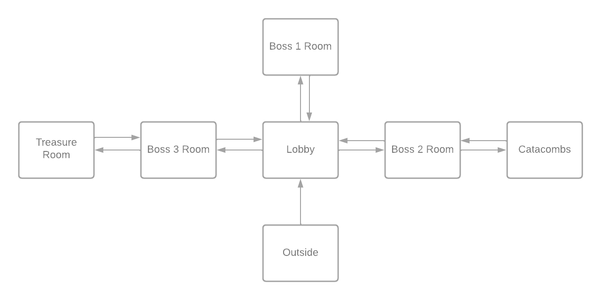
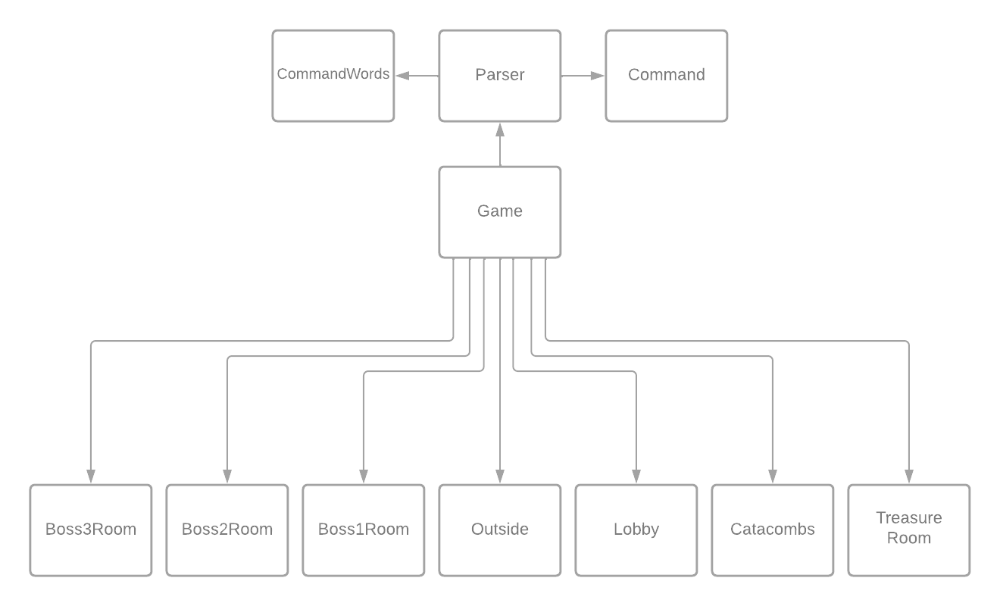

<h1 align="center">RAPPORT IPO</h1>

<p align="center">
  
</p>

<h1 align="center">2022</h1>
<br>
<h1 align="center"><a href="https://perso.esiee.fr/~diouyc/ZuulGOTYEdition"> Zuul GOTY Edition</a></h1>

<div style="page-break-after: always;"></div>

## Sommaire

- [Information générales](#information-générales)
  - [Auteur](#auteur)
  - [Thème](#thème)
  - [Scénario](#scénario)
  - [Plan](#plan)
  - [Scénario détaillé](#scénario-détaillé)
  - [Détail des lieux, items, personnages](#details-des-lieux)
  - [Situations gagnantes et perdantes](#situations-gagnantes-et-perdantes)
  - [Énigmes, mini-jeux, combats](#énigmes,-mini-jeux,-combats)
  - [Commentaires](#commentaires)
- [Réponses aux exercices](#réponses-aux-exercices)
- [Mode d'emploi](#)
- [Déclaration anti-plagiat](#)

<div style="page-break-after: always;"></div>

## Information générales

### Auteur

Charly **DIOUY**
E1 ESIEE PARIS
Groupe 1

### Thème

Un chevalier se retrouve coincé dans un donjon, il doit vaincre tout les boss pour s'échapper

### Scénario

Edward se retrouve bloqué dans un dongeon après s'être caché pendant une bataille, si il veut sortir il va devoir resoudre les énigmes de ce mysterieux dongeon.

### Plan

<p align="center">
  
</p>

### Scénario détaillé

Edward est un chevalier, durant une bataille il decide de s'aventurer dans les Terres Hostilles, un lieu que tous savaient dangereux. Vous incarnerez Edward et vous vivrez l'aventure avec lui. Il se retrouve fasse a une porte par terre, elle semble rouillée et ne pas avoir servi depuis plusieurs années. Une épaisse brume émane de cette porte. Edward décide de rentrer. Il arrive dans un dongeon et la porte disparait derrière lui. Il rencontre Garret, un marchant qui est resté enfermé ici et qui a perdu sa compagne dans ce dongeon. Il vous explique que le dongeon est ensorcelé par Hazelgash, un mage très puissant. Il vous informe aussi qu'avant de pouvoir accéder a la salle du mage il faudra vaincre ses deux serviteurs, un géant et un roi déchu, Warmog et Viego. Ils sont moins puissant que Hazelgash mais ils ont chacuns leurs points forts et leurs points faibles. Ça sera à vous de les trouver pour obtenir les artefacts qui seront utiles pour sortir de ce dongeon.

### Détail des lieux, items, personnages

- #### Lieux

  - Lobby
  - Salle du boss 1
  - Salle du boss 2
  - Salle du boss 3
  - Catacombes
  - Salle du trésor
  - Exterieur (debut du jeu, cinematique ???)

- #### Items

  - Armure de Warmog
  - Lame du Roi Déchu
  - Gantelet cryopyrique
  - Alliance de la défunte

- #### Personnages
  - Edward
  - Warmog le Geant
  - Viego le Roi Déchu
  - Hazelgash le mage Cryopyrique
  - Garret le marchant
  - Loryna la défunte
  - Wyatt le narrateur

### Situations gagnantes et perdantes

- #### Situations gagnantes

  - Rassembler les 3 artefacts
  - Rendre le marchant heureux

- #### Situations perdantes
  - Mourir contre un boss
  - Faire quelque chose d'immoral

### Énigmes, mini-jeux, combats

- #### Enigmes

  - Pourquoi le marchant est méchant au debut
  -

- #### Mini-jeux

  - pas encore d'idée
  -

- #### Combats
  - Combat contre les boss
  - Combat contre le marchant ?? (pas sur)

### Commentaires

Il y a encore beaucoup de travail pour tout finaliser

<div style="page-break-after: always;"></div>

## Réponses aux exercices

#### Exercice 7.0

Réalisation du site internet pour Zuul a l'adresse suivante : [Zuul GOTY Edition](https://perso.esiee.fr/~diouyc/ZuulGOTYEdition)

#### Exercice 7.5

La création de la méthode `printLocationInfo()` dans la classe `Game` permet d'éviter la duplication de code. En effet, il y a, à 2 reprises, le même segment de code (`goRoom()` et `printWelcome()`) pour informer le joueur de sa postion et les sorties disponibles. La création de `printLocationInfo()` permet de remplacer chaque occurence par un appel à la procedure, cela facilite aussi grandement les modifications futures car il y aura juste ce passage de code a modifier si on veut changer le texte pour les informations des salles.

```java
private void printLocationInfo()
{
    System.out.println("You are "+aCurrentRoom.getDescription());
        System.out.print("Exits : ");
        if(aCurrentRoom.aNorthExit != null){
            System.out.print("north");
        }
        if(aCurrentRoom.aEastExit != null){
            System.out.print("east");
        }
        if(aCurrentRoom.aSouthExit != null){
            System.out.print("south");
        }
        if(aCurrentRoom.aWestExit != null){
            System.out.print("west");
        }
        System.out.println();
}
```

Les modifications suivantes ont donc été effectuées dans `goRoom()` et dans `printWelcome()`

```java
public class Game
{
    [...]

    private void goRoom(final Command pDirection)
    {

        [...]

        else
        {
            this.aCurrentRoom=vNextRoom;
            printLocationInfo();
        }
    }

    private void printWelcome()
    {
        System.out.println("Welcome to the World of Zuul !");
        System.out.println("World of Zuul is a new, incredibly boring adventure game.");
        System.out.println("Type 'help' if you need help.");
        printLocationInfo();
    }

}
```

#### Exercice 7.6

La création de l'accesseur `getExit()` dans la classe `Room` permet de reduire le couplage, et de respecter un principe fondamental d'une bonne conception de classe qui est _l'encapsulation_. Cela nous permet de passer les attributs de la classe en privé. Le code passe de

```java
public class Room
{
    public String   aDescription;
    public Room     aNorthExit;
    public Room     aEastExit;
    public Room     aSouthExit;
    public Room     aWestExit;

    [...]
}
```

à

```java
public class Room
{
    private String   aDescription;
    private Room     aNorthExit;
    private Room     aEastExit;
    private Room     aSouthExit;
    private Room     aWestExit;

    [...]

    public Room getExit(String pDirection){
        if(pDirection.equals("north")){
            return aNorthExit;
        }
        if(pDirection.equals("east")){
            return aEastExit;
        }
        if(pDirection.equals("south")){
            return aSouthExit;
        }
        if(pDirection.equals("west")){
            return aWestExit;
        }
        return null;
    }
}
```

Il y a aussi des modifications à faire dans la classe `Game` qui sont

```java
public class Game
{

    [...]

    private void goRoom(final Command pDirection){

        [...]

        Room vNextRoom = aCurrentRoom.getExit(vDirection);

        [...]
    }

    [...]

    private void printLocationInfo()
    {
        System.out.println("You are "+aCurrentRoom.getDescription());
        System.out.print("Exits : ");
        if(aCurrentRoom.getExit("north") != null){  // précédemment if(aCurrentRoom.aNorthExit != null){
            System.out.print("north ");
        }
        if(aCurrentRoom.getExit("east") != null){   // précédemment if(aCurrentRoom.aEastExit != null){
            System.out.print("east ");
        }
        if(aCurrentRoom.getExit("south") != null){  // précédemment if(aCurrentRoom.aSouthExit != null){
            System.out.print("south ");
        }
        if(aCurrentRoom.getExit("west") != null){   // précédement if(aCurrentRoom.aWestExit != null){
            System.out.print("west ");
        }
        System.out.println();
    }
}
```

#### Exercice 7.7

La création de la méthode `getExitString()` doit être crée dans la classe `Room` car celle-ci gère tout ce qui réfère aux salles.

```java
public String getExitString()
    {
        String vExit = "Exits : ";

        if (this.aNorthExit!=null)
        {
            vExit += "north ";
        }

        if (this.aSouthExit!=null)
        {
            vExit += "south ";
        }

        if (this.aEastExit!=null)
        {
            vExit += "east ";
        }

        if (this.aWestExit!=null)
        {
            vExit += "west ";
        }
        return vExit;
    }
```

L'affichage se passe dans la classe `Game` avec la methode `printLocationInfo()` précédemment crée.

```java
private void printLocationInfo()
{
    System.out.println("You are "+currentRoom.getDescription());
    System.out.println(aCurrentRoom.getExitString());
}
```

#### Exercice 7.8

Modification des attributs de la classe `Room` pour les mettre dans une `HashMap`, pour ce faire il faut écrire en haut de la classe `import java.util.HashMap;`et pour l'initialiser `private HashMap<String, Room> aExits;`. Le code de la classe `Room` est donc comme suit

```java
import java.util.HashMap;

public class Room
{
    private HashMap<String, Room> aExits;

    public Room(final String pDescription) {
        this.aDescription = pDescription;
        this.aExits = new HashMap<String,Room>();
    }

    public void setExits(final String pDirec, Room pNeighbor){
        aExits.put(pDirec, pNeighbor);
    }

    public Room getExit(String pDirection){
        return aExits.get(pDirection);
    }

    public String getExitString()
    {
        String vExit = "Exits : "+this.aExits;
        return vExit;
    }
}
```

et des changements dans `Game`

```java
public class Game
{

    [...]

    private void createRooms(){

        [...]

        vOutside.setExits("east", vTheatre);
        vOutside.setExits("south", vLab);
        vOutside.setExits("west", vPub);

        vTheatre.setExits("west", vOutside);

        vPub.setExits("east", vOutside);

        vLab.setExits("north", vOutside);
        vLab.setExits("east", vOffice);

        vOffice.setExits("west", vLab);

        [...]
    }

    [...]

}
```

#### Exercice 7.8.1

L'ajout d'un déplacement vertical entre l'extérieur et le dongeon est réalisé. Les directions sont donc maintenant : `north`, `east`, `south`, `west` et `down`

```java
vOutside.setExits("down", vLobby);
```

#### Exercice 7.9

La méthode `keySet()` permet d'associer des valeurs arbitraires à des clés.

```java
import java.util.Set;
```

Ainsi, il peut associer le mot de commande à la clé qui ouvrira l'accès à la `HashMap` contenant toutes les pièces. **Exemple :** pour le lobby, les sorties sont `north`, `east` et `west`. La clé nord sur la commande `go north` permettra d'accéder à la salle au nord du lobby.

#### Exercice 7.10

La methode `getExitString()` permet de récupérer toutes les sorties d'une pièce sous forme d'une `String`

```java
String vReturnString = "Exits : ";
```

Cette ligne crée une variable `vReturnString` de type `String` qui contient la chaine de caractères `"Exits : "`

```java
Set<String> vKeys = aExits.keySet();
```

Celle-ci crée une variable `vKeys` de type `Set<String>`. Les éléments contenus sont les clés de la `HashMap aExits` sous forme d'une liste de `String` qui ne peut pas comporter 2 fois le même élément.

```java
for(String vExit : vKeys){
    vReturnString += " " + vExit;
}
```

Ce bout de code est une boucle `for each` qui parcours la liste des clés stockées. `vExit` est une variable qui prend la valeur de la prochaine clé de la `HashMap`à chaque fois que la bocule se répète, ce qui fait que `vReturnString` obtient toutes les sorties disponibles dans la `String`.

```java
return vReturnString;
```

La derniere partie du code retourne la chaine de caractères possédant toutes les sorties de la salle.

#### Exercice 7.11

La fonction `getLongDescription()` retourne une chaine de caractères informant le joueur de sa position actuelle et des sorties de la salle

```java
public String getLongDescription(){
    return "You are " + aDescription + ".\n" + getExitString();
}
```

Dans la classe `Game` on effectue donc des modifications

```java
private void printLocationInfo() {
    System.out.println(aCurrentRoom.getLongDescription());
}
```

#### Exercice 7.12

Les objets crées au lancement du programme sont imagés dans ce diagramme

<p align="center">
  
</p>

#### Exercice 7.13

Lorsque la commande `go` est exécuté, l'objet courrant change, c'est a dire, passer d'une salle à l'autre

#### Exercice 7.14

On ajoute la commande `look` dans la classe `CommandWords` avec cette ligne

```java
this.aValidCommands[3] = "look";
```

Une fois fait, il faut créer une methode pour la commande `look` qui nous permettra d'avoir les informations sur la salle et ses sorties autant de fois que nous le souhaitons

```java
private void look(){
    printLocationInfo();
}
```

Nous devons ajouter les lignes de code ci-dessous dans la fonction `processCommand()` de la classe `Game` pour que la méthode fonctionne lorsqu'elle est saisie au clavier

```java
else if(pCommand.getCommandWord().equals("look")){
    this.look();
}
```

#### Exercice 7.15

On refait la même chose pour la commande `eat`. C'est à dire ajout de la commande `eat` dans la classe `CommandWords`

```java
this.aValidCommands[4] = "eat";
```

Création d'une méthode pour la commande `eat`

```java
private void eat(){
    System.out.println("You have eaten now and you are not hungry any more.");
}
```

Ajout des lignes de code ci-dessous dans la fonction `processCommand()` de la classe `Game` pour que la méthode fonctionne lorsqu'elle est saisie au clavier

```java
else if(pCommand.getCommandWord().equals("eat")){
    this.eat();
}
```

#### Exercice 7.16

On crée une méthode `showAll()` dans la classe `CommandWords` pour regrouper toutes les commandes dans une `String`

```java
public void showAll(){
    for(String vCommand : aValidCommands){
        System.out.print(vCommand + " ");
    }
    System.out.println();
}
```

Ensuite, dans la classe `Parser`, on crée une méthode `showCommands()` pour afficher toutes les commandes

```java
public void showCommands(){
    aValidCommands.showAll();
}
```

Puis on remplace le texte écrit "en dur" par la methode `showCommands()` afin de le rendre dynamique. Lorsque nous voudrons ajouter d'autres commandes, il s'adaptera automatiquement

```java
private void printHelp() {

    [...]

    System.out.println("Your command words are:");
    aParser.showCommands();
}
```

#### Exercice 7.17

Si nous voulons ajouter une autre commande il faudra modifier la classe `Game` en ajoutant la methode de la commande et ajouter la ligne permantant l'exécution dans `processCommand()`

```java
else if(pCommand.getCommandWord().equals("command")){
    this.command(); // command signifie une commande générale pouvant être intégrée au jeu
}
```

#### Exercice 7.18

Dans la classe `CommandWords` la méthode `showAll()` devient la fonction `getCommandList()` et subit les modifications ci-dessous

```java
public String getCommandList()
{
    StringBuilder sCommands = new StringBuilder();
    for(int i = 0; i < aValidCommands.length; i++) {
        sCommands.append( aValidCommands[i] + "  " );
    }
    return sCommands.toString();
}
```

La méthode `showCommands()` est aussi modifiée par une fonction `getCommandString()`

```java
public String getCommandString()
{
    return this.aValidCommands.getCommandList();
}
```

Les modifications sont légères dans `printHelp()` il y a juste à remplacer `aParser.showCommands()` par `aParser.getCommandString()`

```java
private void printHelp() {

    [...]

    aParser.getCommandString();
}
```

#### Exercice 7.18.1

Les deux projets sont vraiment similaires ce qui est logique car j'ai suivi les exercices demandés. Néanmoins il faut noter deux differences notables qui sont l'ajout des commandes : `look` et `eat`

#### Exercice 7.18.2

Objet mutable qui peut donc changer au cours du temps. On peut construire petit à petit une chaîne de caractère, avec la méthode `append()` qui ajoute des caractères à la suite des autres, et toString qui retourne la chaîne.
[source](https://docs.oracle.com/javase/7/docs/api/java/lang/StringBuilder.html)

#### Exercice 7.18.3

La recherche d'images est plutôt compliquée pour trouver ce qui me plait. Je vais m'orienter vers la création des decors pour le jeu.

#### Exercice 7.18.4

Le titre du jeu est : Zuul GOTY Edition
